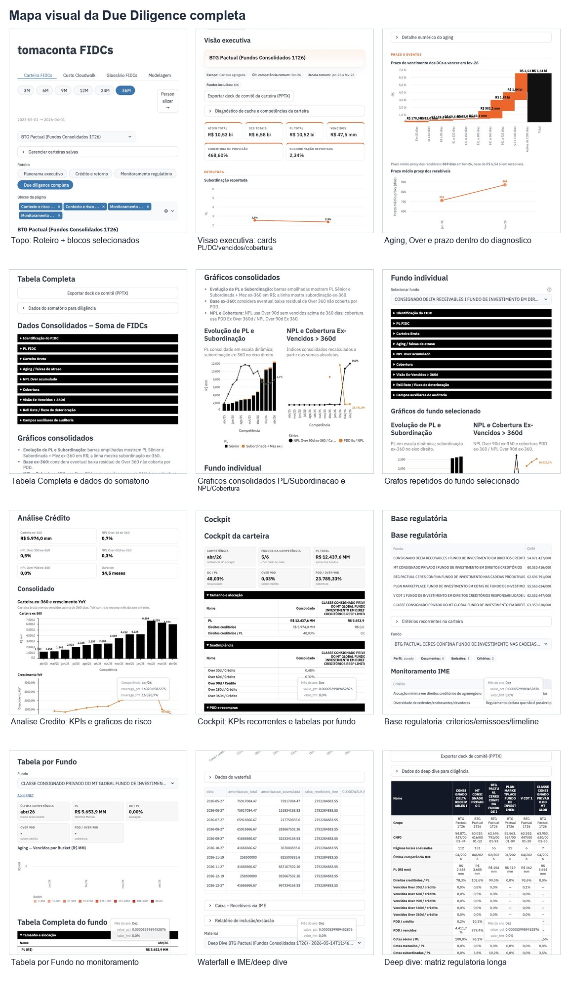
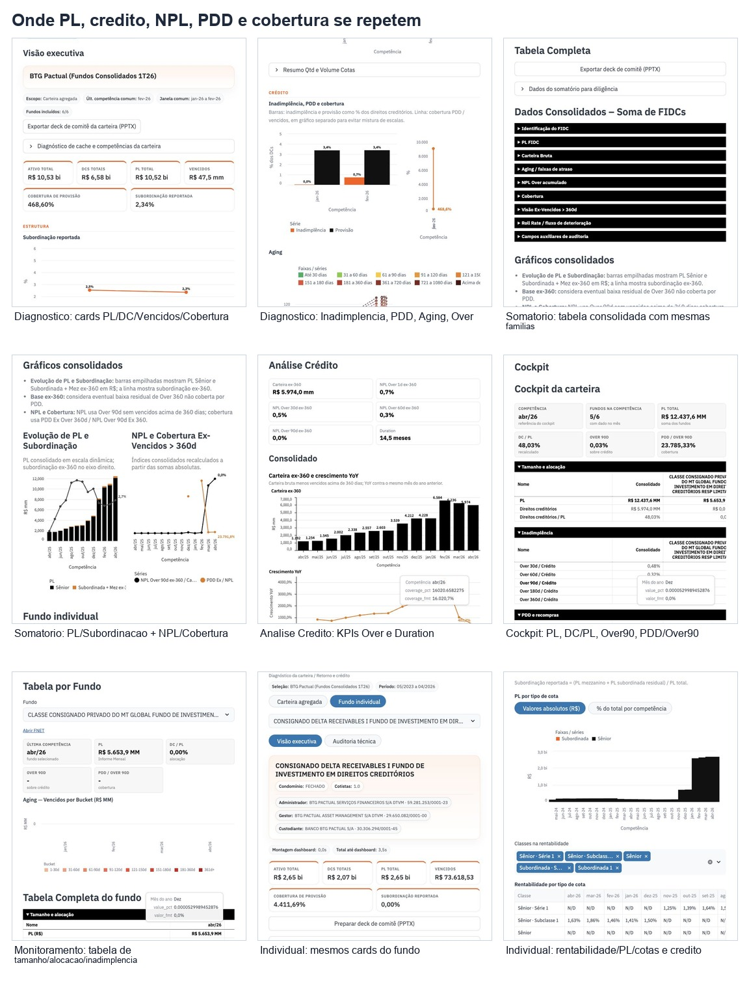
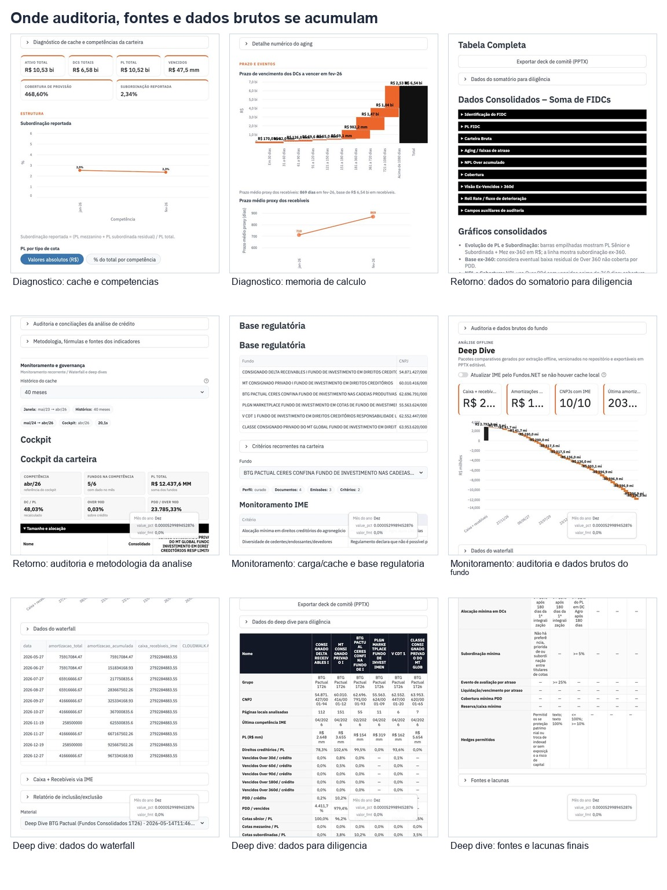
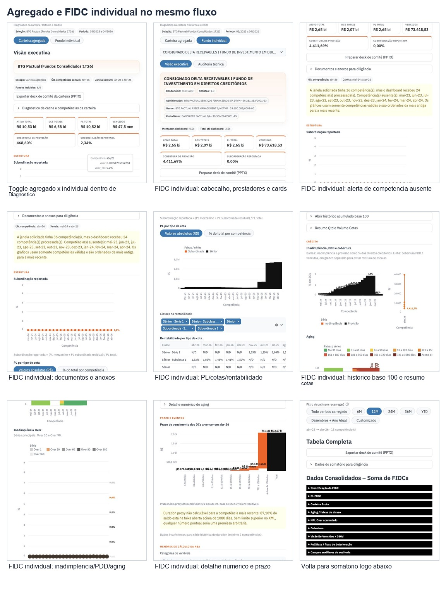

# Auditoria Visual - Carteira FIDCs

Data da auditoria: 2026-05-28  
App auditado: `Carteira FIDCs` no Streamlit local (`localhost:8502`)  
Carteira usada como amostra visual: `BTG Pactual (Fundos Consolidados 1T26)`  
Roteiros capturados: `Panorama executivo`, `Due diligence completa` e alternancia `Carteira agregada` / `Fundo individual`

## Como Ler

Este documento nao implementa cortes no produto. Ele mapeia onde a experiencia atual repete dados, graficos, tabelas e trilhas de auditoria, para voce decidir o que manter, fundir, esconder em drill-down ou remover.

Folhas visuais principais:

## Mapa Atual

| ID | Caminho visual no app | Screenshot | Origem no codigo | Funcao atual |
| --- | --- | --- | --- | --- |
| A1 | `Carteira FIDCs > Roteiro > Due diligence completa > topo` | `screenshots/due_01_y0.jpg` | `tabs/portfolio_page.py` | Escolhe roteiro e blocos, mas tambem repete carteira, janela e periodo ja definidos no topo global. |
| A2 | `Contexto e risco > Diagnostico da carteira > Visao executiva` | `screenshots/due_02_y1000.jpg` | `tabs/tab_fidc_ime_carteira.py` | Cards de Ativo, DCs, PL, Vencidos, Cobertura, Subordinacao e graficos de estrutura. |
| A3 | `Diagnostico da carteira > Credito` | `screenshots/due_04_y2300.jpg` | `tabs/tab_fidc_ime_carteira.py` / `tabs/tab_fidc_ime.py` | Inadimplencia, PDD, cobertura, aging e Over. |
| A4 | `Diagnostico da carteira > Prazo e eventos` | `screenshots/due_05_y4100.jpg` | `tabs/tab_fidc_ime_carteira.py` / `services/fidc_monitoring.py` | Prazo de vencimento e prazo medio proxy. |
| B1 | `Retorno e credito > Tabela Completa` | `screenshots/due_07_y5490.jpg` | `tabs/tab_mercado_livre.py` | Tabela larga do somatorio, com grupos de PL, carteira bruta, aging, NPL, cobertura, ex-360 e roll rate. |
| B2 | `Retorno e credito > Graficos consolidados` | `screenshots/due_08_y6090.jpg` | `tabs/tab_mercado_livre.py` | Evolucao de PL/subordinacao e NPL/cobertura no consolidado. |
| B3 | `Retorno e credito > Fundo individual` | `screenshots/due_09_y6800.jpg` | `tabs/tab_mercado_livre.py` | Repete a tabela larga e os graficos para um fundo selecionado. |
| B4 | `Retorno e credito > Analise Credito` | `screenshots/due_10_y7920.jpg` | `tabs/tab_dashboard_meli.py` via `tabs/tab_mercado_livre.py` | KPIs ex-360, crescimento, NPL por severidade, roll rates, duration e cohorts. |
| C1 | `Monitoramento recorrente > Cockpit` | `screenshots/due_15_y15860.jpg` | `tabs/tab_fidc_monitoring.py` | KPIs recorrentes por competencia e tabelas por fundo para tamanho, alocacao, inadimplencia, PDD e retorno. |
| C2 | `Monitoramento recorrente > Base regulatoria` | `screenshots/due_16_y17120.jpg` | `tabs/tab_fidc_monitoring.py` | Base de criterios, emissoes/calendario, monitorabilidade e timeline documental CVM. |
| C3 | `Monitoramento recorrente > Tabela por Fundo` | `screenshots/due_19_y18600.jpg` | `tabs/tab_fidc_monitoring.py` | Cockpit e tabela completa do fundo, repetindo KPI e series do cockpit. |
| D1 | `Waterfall e deep dives > Waterfall` | `screenshots/due_22_y21000.jpg` | `tabs/tab_deep_dive.py` | Waterfall offline, caixa/recebiveis via IME e relatorio de inclusao/exclusao. |
| D2 | `Waterfall e deep dives > Dados do deep dive` | `screenshots/due_24_y22000.jpg` | `tabs/tab_deep_dive.py` | Matriz longa de deep dive com paginas, IME, PL, vencidos, PDD, cotas, emissoes e criterios. |
| E1 | `Diagnostico da carteira > Fundo individual` | `screenshots/individual_01_y900.jpg` | `tabs/tab_fidc_ime.py` chamado por `tabs/tab_fidc_ime_carteira.py` | Dashboard individual completo dentro da pagina de carteira. |
| E2 | `Diagnostico da carteira > Fundo individual > documentos/anexos` | `screenshots/individual_03_y1650.jpg` | `tabs/tab_fidc_ime.py` | Documentos e anexos para diligencia, alem de alertas de competencias ausentes. |
| E3 | `Diagnostico da carteira > Fundo individual > credito/aging/prazo` | `screenshots/individual_06_y4100.jpg` | `tabs/tab_fidc_ime.py` | Repete inadimplencia, PDD, aging, Over e prazo para o fundo selecionado. |

## Sobreposicoes Relevantes

| Familia de informacao | Onde aparece hoje | Grau | Leitura tecnica | Decisao sugerida |
| --- | --- | --- | --- | --- |
| Periodo, janela e competencia | Topo global, cabecalho compacto da carteira, `Visao executiva`, `Janela da Soma de FIDCs`, filtro visual, cockpit e alertas individuais | Alto | O analista ve 3 a 6 referencias temporais antes de chegar ao dado. Algumas sao diferentes por regra metodologica, mas a UI nao deixa claro o que e filtro global, janela carregada, janela comum e competencia de cockpit. | Criar uma unica barra fixa de contexto com `Periodo global`, `Janela usada`, `Competencia do cockpit` e `Excecoes`; remover repeticoes locais ou reduzir para tooltip. |
| PL, DCs, vencidos, cobertura e subordinacao | A2, B1, B2, C1, C3, D2, E1 | Muito alto | Sao as metricas centrais e devem existir, mas hoje entram como cards, tabela larga, grafico, cockpit, tabela por fundo e deep dive. | Manter A2 como resumo executivo; manter B2 ou B4 como analise historica canonica; no cockpit, mostrar apenas quando houver criterio regulatorio/alerta. |
| Inadimplencia, PDD, aging e Over | A3, B1, B2, B4, C1, C3, D2, E3 | Muito alto | A mesma familia de risco aparece em diagnostico, somatorio, analise de credito, monitoramento e deep dive. A diferenca ex-360 vs IME bruto e importante, mas fica espalhada. | Tornar `Analise Credito` a visao canonica de risco historico; deixar `Diagnostico` com 3 sinais executivos; deixar `Monitoramento` focado em regra/threshold. |
| PL por tipo de cota, cotas e retorno | A2, B1/B2, C1/C3, E1/E3 | Alto | Estrutura de cotas aparece como composicao, rentabilidade, subordinacao e retorno. | Separar: estrutura/subordinacao em `Diagnostico`; retorno/cota em `Retorno e credito`; detalhes brutos em auditoria unica. |
| Prazo, duration e maturacao | A4, B4, E3 | Medio | `Prazo medio proxy` e `Duration` sao parecidos para decisao, embora venham de logicas diferentes. | Unificar num bloco `Prazo e maturacao`; manter explicacao metodologica em expander tecnico. |
| Consolidado vs fundo individual | B3, C3, E1-E3 | Alto | Existem tres formas de olhar fundo individual dentro da mesma pagina: diagnostico individual, somatorio individual e monitoramento por fundo. | Criar um unico seletor de fundo persistente e um unico painel individual; os blocos analiticos devem ler esse fundo, nao recriar subpaginas. |
| Auditoria, cache, dados brutos e metodologia | A2/A4, B1/B4, C1/C3, D2, E2/E3 | Muito alto | A auditoria e valiosa, mas hoje vira varias paradas de scroll. O analista operacional precisa dela sob demanda, nao no caminho principal. | Consolidar em `Auditoria tecnica e fontes`, com secoes: carga/cache, formulas, dados brutos, documentos, lacunas e downloads. |
| Base regulatoria e deep dive | C2, D2 | Alto | A `Base regulatoria` ja responde criterios monitoraveis, emissoes/calendario e timeline. O deep dive repete parte disso em tabela longa de pacote. | Fazer C2 ser a visao canonica regulatoria. D2 vira evidencia/export do pacote e narrativas offline, nao uma segunda matriz principal. |
| Waterfall | D1 | Baixo/medio | E um bloco menos repetido; a sobreposicao vem de caixa/recebiveis via IME e deep dive. | Manter como bloco separado, mas sem repetir tabelas IME completas ja presentes no monitoramento. |

## Cortes Candidatos Sem Perda De Conteudo

1. Manter no caminho principal:
   - resumo executivo de A2;
   - uma visao historica canonica de risco/credito, preferencialmente B4;
   - base regulatoria canonica C2;
   - waterfall D1.

2. Mover para drill-down ou auditoria:
   - `Dados do somatorio para diligencia`;
   - `Auditoria da base do Somatorio`;
   - `Auditoria e conciliacoes da analise de credito`;
   - `Metodologia, formulas e fontes dos indicadores`;
   - `Auditoria e dados brutos do fundo`;
   - `Dados do deep dive para diligencia`;
   - `Fontes e lacunas`;
   - tabelas largas repetidas de fundo individual quando ja houver seletor global de fundo.

3. Fundir:
   - `Diagnostico da carteira > Credito` com `Analise Credito`, deixando o primeiro como resumo e o segundo como detalhe;
   - `Tabela por Fundo` do monitoramento com o painel individual unico;
   - `Base regulatoria` com a parte regulatoria do deep dive;
   - `Prazo medio proxy` e `Duration` num bloco unico de maturacao.

4. Renomear para reduzir sobreposicao mental:
   - `Retorno e credito` pode virar `Credito historico e retorno`;
   - `Monitoramento recorrente` pode virar `Alertas regulatorio/IME`;
   - `Waterfall e deep dives` pode virar `Waterfall e evidencias offline`;
   - `Auditoria tecnica` deve ser uma area unica, nao uma subarea repetida em cada bloco.

## Arquitetura Recomendada Para Decisao

Opcao conservadora, sem apagar conteudo:

1. `Resumo`
   - cards: PL, DCs, Over 90, PDD/Over, subordinacao, ultima competencia;
   - 2 graficos: PL/subordinacao e NPL/cobertura;
   - alertas de qualidade/cobertura dos dados.

2. `Credito`
   - B4 como visao canonica;
   - toggles para consolidado/fundo individual;
   - aging, roll rate, duration/cohorts como subblocos.

3. `Regulatorio`
   - C2 como canonico: Monitoramento IME, emissoes/calendario, criterios monitoraveis, timeline CVM;
   - alertas contra thresholds quando possivel.

4. `Waterfall`
   - D1 preservado;
   - ligacoes para caixa/recebiveis e relatorio, sem repetir a matriz IME inteira.

5. `Auditoria e Fontes`
   - todos os expanders tecnicos, bases brutas, downloads, formulas, documentos e lacunas.

## Decisoes Que Precisam De Voce

| Decisao | Minha recomendacao | Alternativa conservadora | Impacto |
| --- | --- | --- | --- |
| Qual bloco vira canonico para risco de credito? | `Analise Credito` | `Diagnostico da carteira > Credito` | Define onde ficam NPL, PDD, aging, roll rate e duration. |
| O cockpit deve repetir KPIs ou virar painel de alertas? | Virar painel de alertas | Manter KPIs, mas compactar | Reduz muito scroll em `Monitoramento recorrente`. |
| Manter tabelas largas no caminho principal? | Nao; mover para `Auditoria e Fontes` | Deixar recolhidas por padrao | Reduz repeticao visual sem perder dados. |
| Fundo individual deve aparecer em tres blocos? | Nao; criar painel individual unico | Manter, mas sincronizar seletor e recolher graficos duplicados | Evita que o analista veja o mesmo fundo em tres narrativas. |
| Deep dive deve repetir base regulatoria? | Nao; deep dive vira evidencia/export | Manter matriz longa so em expander | Evita duplicacao com `Base regulatoria`. |

## Anexo De Screenshots

As capturas brutas estao em `reports/ui_audit_fidc_dashboard/screenshots/`.  
As folhas visuais consolidadas estao em `reports/ui_audit_fidc_dashboard/contact_sheets/`.

